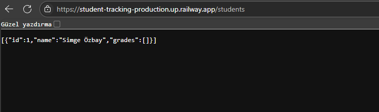
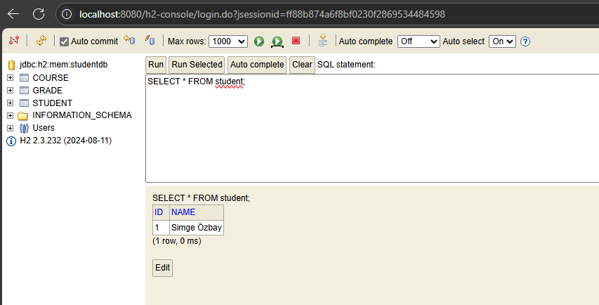

Simge Özbay - H5230018
# Student Tracking Projesi(Öğrenci Takip)

Bu proje, Spring Boot kullanarak geliştirilmiş basit bir öğrenci takip sistemidir. Öğrencilerin eklenmesi, listelenmesi ve silinmesi gibi işlemleri REST API üzerinden sağlar. Ayrıca Java 8 özellikleri, generic programlama, multithread ve temel sıralama/arama algoritmaları içermektedir.
src/main/java/com/example/student_tracking/
├── controller

│ ├── StudentController.java # REST API endpointleri (Öğrenci CRUD işlemleri)

│ ├── Sorter.java # Sıralama ve arama algoritmaları

│ └── BackgroundTask.java # Multithread işlemleri için thread örneği

│
├── model

│ └── Student.java # Öğrenci entity modeli

│
├── repository

│ └── StudentRepository.java # Spring Data JPA repository - Öğrenci veritabanı işlemleri

│
└── StudentTrackingApplication.java # Spring Boot uygulama başlangıç sınıfı
## Kullanılan Teknolojiler

- **Spring Boot**: REST API oluşturmak için framework
- **Spring Data JPA**: Veritabanı işlemleri için
- **H2 Database**: Bellek içi veritabanı
- **Java 8**: Stream API, Lambda ifadeleri, Generic Programlama, Multithread, Sıralama ve Arama algoritmaları
- **Maven/Gradle**: Proje ve bağımlılık yönetimi

---

## Özellikler

- Öğrenci CRUD işlemleri (Ekle, Listele, Sil)
- Java 8 Stream API kullanımı
- Generic programlama örnekleri
- Multithread arka plan görevleri
- Temel sıralama ve arama algoritmaları

https://student-tracking-production.up.railway.app/students

